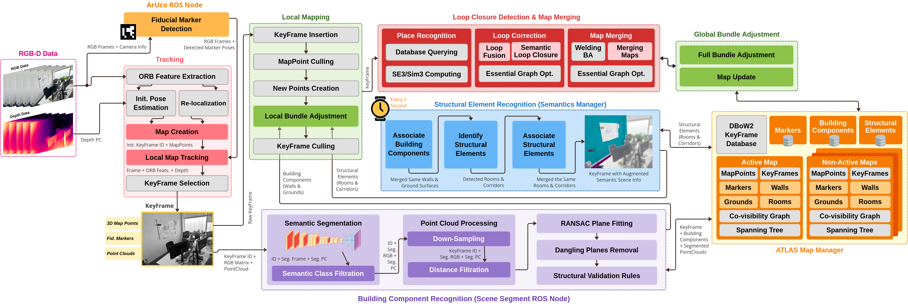

# Visual S-Graphs (vS-Graphs)


<!-- Badges -->

[](https://arxiv.org/abs/2503.01783)
[](https://www.gnu.org/licenses/gpl-3.0)

**vS-Graphs** is inspired by [LiDAR S-Graphs](https://github.com/snt-arg/lidar_situational_graphs) and extends [ORB-SLAM 3.0](https://github.com/UZ-SLAMLab/ORB_SLAM3) by integrating **optimizable 3D scene graphs**, enhancing mapping and localization accuracy through scene understanding. It improves scene representation with building components (_i.e.,_ wall and ground surfaces) and infering structural elements (_i.e.,_ rooms and corridors), making SLAM more robust and efficient.

## 🧠 vS-Graphs Architecture

Below diagram shows the detailed architecture of the **vS-Graphs** framework, highlighting the key threads and their interactions. Modules with a light gray background are inherited directly from the baseline (_ORB-SLAM 3.0_), while the remaining components are newly added or modified components.



## 🚀 Prerequisites and Installation

For system requirements, dependencies, and setup instructions, refer to the [Installation Guide](/doc/INSTALLATION.md).

## 🔨 Configurations <a id="configurations"></a>

You can find the configuration files for the application in the `config` folder. It contains some `Calibration` processes, camera parameter for various sensors, and some `rviz` files for different datasets. You can define your own `rviz` and `yaml` files according to the characteristics of the sensor you collected data with. A sample of how to set camera intrinsic and extrinsic parameters can be found [here](https://github.com/shanpenghui/ORB_SLAM3_Fixed#73-set-camera-intrinsic--extrinsic-parameters).

You can read about the configuration parameters (independent of the `ROS` wrapper) for performing SLAM [here](/config/README.md). They can be find and modified in [system_params.yaml](/config/system_params.yaml).

## 🚀 Run Examples <a id="run"></a>

1. You can download some sample dataset instances from the links provided below and run them using `rosbag play [sample].bag --clock [-s x]`:
2. Run the ArUco marker detector module using `roslaunch aruco_ros marker_publisher.launch`
3. Run the Semantic Segmentation module (pFCN) using `roslaunch segmenter_ros segmenter_pFCN.launch`
4. Run VoxBlox Skeleton using `roslaunch voxblox_skeleton skeletonize_map_vsgraphs.launch 2>/dev/null`

For a complete list of configurable launch arguments, see [Launch Parameters](/launch/README.md).

#### 🦊 Voxblox Integration <a id="voxblox-integrate"></a>

For detecting rooms, you need to use `voxblox skeleton` instead of the normal version of `voxblox`, as it uses free spaces for clustering in `skeletonize_map_vsgraphs` launch file.

If you want to use normal `voxblox` (faces challenges for room creation), you may need to first create a launch file that can be integrated into this framework. You can find a sample of such launch file [here](doc/voxblox_rs_rgbd.launch). Then, for running `voxblox`, you need to source it and run it in a separate terminal using `roslaunch voxblox_ros vsgraphs_rgbd.launch`.

Additionally, before running the framework, you need to source it, source `voxblox` with a `--extend` command, and then launch the framework.

```
source /opt/ros/noetic/setup.bash &&
source ~/[VSGRAPHS_PATH]/devel/setup.bash &&
source ~/[VOXBLOX_PATH]/devel/setup.bash --extend &&
roslaunch orb_slam3_ros vsgraphs_rgbd.launch 2>/dev/null
```

[Note] As `voxblox` and `Visual S-Graphs` both need to access/modify `TF` data, it may become slow. So, in order to run it with less computation cost and avoid chunking the reconstructed map, you may need to:

- Use the command `catkin config --cmake-args -DCMAKE_BUILD_TYPE=Release` in `voxblox`'s workspace to build it in the release mode and run it again,
- Run the rosbag file slower using `rosbag play [file] --clock -r 0.5`

#### ArUco Detector Integration <a id="aruco-integrate"></a>

Note that given the input sensor (Mono, RGB-D, and Stereo), the parameters fed to `aruco_ros` varies. Regarding the sample launch file available [here](doc/aruco_ros_marker_publisher.launch), we can use the library as below:

- For Mono and RGB-D feed use `roslaunch aruco_ros marker_publisher.launch`,
- For Stereo feed use `roslaunch aruco_ros marker_publisher.launch imageRaw:=/camera/infra1/image_rect_raw 
cameraInfo:=/camera/infra1/camera_info`

Please refer to [this page](/doc/RealSense/README.md) for detailed description on how to use a RealSense D400 series camera for data collection.

## 🤖 ROS Topics, Params and Services <a id="ros"></a>

For more information on ROS-related configurations and usage, see the [ROS documentation](/doc/ROS.md).

## 🐋 Docker

For a fully reproducible and environment-independent setup, check the [Docker](/docker) section.

## 📚 Citation

```bibtex
@article{tourani2025vsgraphs,
  title={vS-Graphs: Integrating Visual SLAM and Situational Graphs through Multi-level Scene Understanding},
  author={Tourani, Ali and Ejaz, Saad and Bavle, Hriday and Morilla-Cabello, David and Sanchez-Lopez, Jose Luis and Voos, Holger},
  journal={arXiv preprint arXiv:2503.01783},
  year={2025},
  doi={https://doi.org/10.48550/arXiv.2503.01783}
}
```

## 📎 Related Repositories

- 🔧 [LiDAR S-Graphs](https://github.com/snt-arg/lidar_situational_graphs)
- 🎞️ Scene Segmentor ([ROS1](https://github.com/snt-arg/scene_segment_ros))

## 🔑 License

This project is licensed under the GPL-3.0 license - see the [LICENSE](/LICENSE) for more details.
